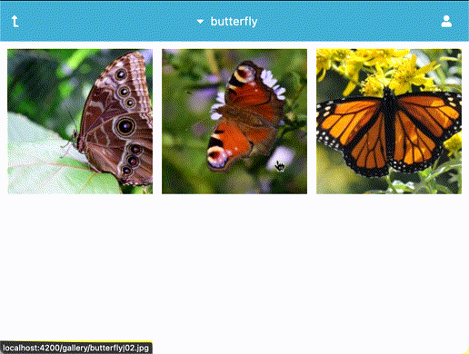

# IDS

IDS is the acronym of: *Image Directory Sharing* whose aims are:
 * Share images from a directory
 * Doesn't use a database
 
It's composed of two parts :

 * [ids-backend](https://github.com/cyosp/ids-backend)
 * [ids-frontend](https://github.com/cyosp/ids-frontend)

Which are combined in this repository in a single way.

## Features demonstration

 * Delete image (administrator only)

   

   Demonstration key points:
    * Confirm delete dialog canceled
    * Delete failed
    * Delete succeeded

## Start

Start IDS on port `8888` via: `docker-compose up -d`

## Stop

Stop IDS with: `docker-compose down`
